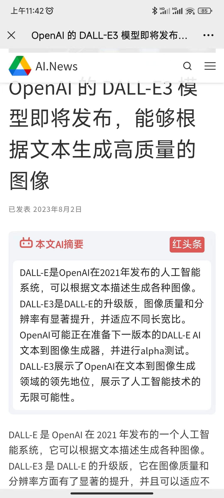
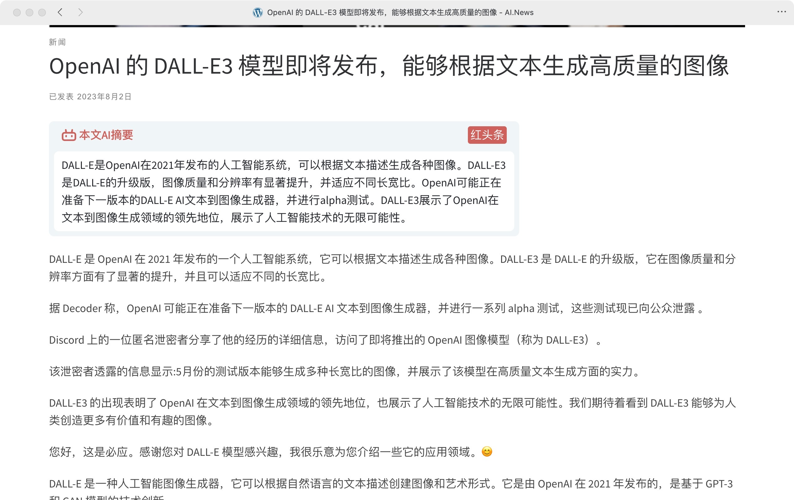
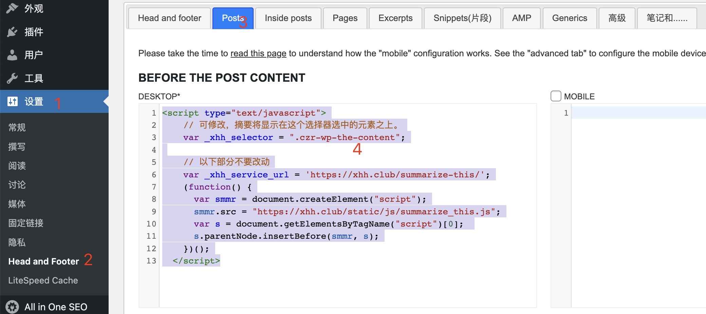
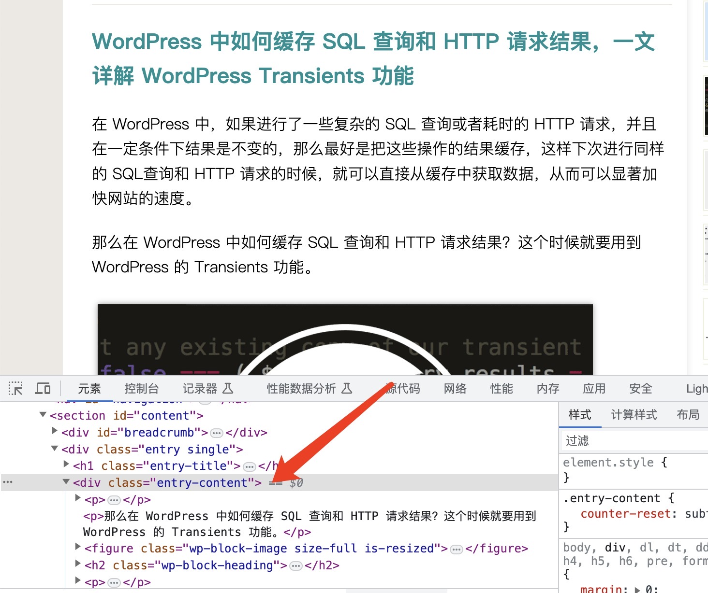

# 在博客免费集成红头条「AI摘要」

* [简介](#1简介)
* [效果展示](#2效果展示)
* [前置条件](#3前置条件)
* [在 WordPress 中集成](#4在-wordpress-中集成)
* [在其它系统中集成](#5在其它系统中集成)
* [联系方式](#6联系方式)

## 1、简介

因为红头条（https://xhh.club/）本来就给很多博客文章做了摘要了，搞了个方案，给大家放到自己的博客里面去。这样大家就不用对接 OpenAI，也不用出钱。

## 2、效果展示



手机效果



PC效果

## 3、前置条件

1. 支持 RSS，可以是 RSS 1.0/2.0、Feed、Atom 等协议。
2. 已被「红头条」收录，未收录可拉到本文最后联系我们收录。

## 4、在 WordPress 中集成

安装一个可以在页面中插入代码的插件，在这里以 Stefano Lissa 开发的「Head, Footer and Post Injections」为例。



安装后可以在「设置 -> Head and Footer」菜单中找到它，然后切换到「Posts」标签页，表示我们的代码只插入到文章页。然后在「BEFORE THE POST CONTENT」下的 DESKTOP 下复制粘贴以下代码：

```html
  <script type="text/javascript">
    // 可修改，摘要将显示在这个选择器选中的元素之上。
    var _xhh_selector = ".entry-content";
    // 可修改，定制最外层 DIV 的风格。
    // 默认限制宽度为 750px，上下加 8px 的镶边，4 像素圆角。
    var _xhh_style = "max-width: 750px; margin:8px 0px; border-radius: 4px;";

    // 以下部分不要改动
    var host = '///xhh.club';
    var _xhh_service_url = host + '/summarize-this/';
    (function() {
      var smmr = document.createElement("script");
      smmr.src = host + "/static/js/summarize_this.js";
      var s = document.getElementsByTagName("script")[0]; 
      s.parentNode.insertBefore(smmr, s);
    })();
  </script>
```

代码中的 `_xhh_style` 可以修改，设置为自己喜欢的风格。

代码中的 `_xhh_selector` 可以修改，好像安装了不同的 WP 主题是会不一样的，可以通过浏览器右键菜单的「检查」功能来查看自己博客的内容 DIV 是哪个，如下图，要把 `_xhh_selector` 的值改为 `".entry-content"`。



WordPress 有很多插件，有些会改变URL，比如「Google Analytics for WordPress by MonsterInsights」会把 RSS Feed 中的 URL 加上一些 UTM 参数，但从文章列表点开文章的 URL 是不带这些参数的。「红头条」的AI摘要依赖URL来查找对应的摘要，出现这种情况时就会出找不到摘要。所以如果在用「Google Analytics for WordPress by MonsterInsights」或类似的插件，请禁用掉。

## 5、在其它系统中集成

在其它系统中集成可以参照上文 WordPress 的部分，大体就是找到内容页的模板，然后插入上述代码。

## 6、联系方式


加微信群，如果上述二维码无效，加微信：laiyonghao
